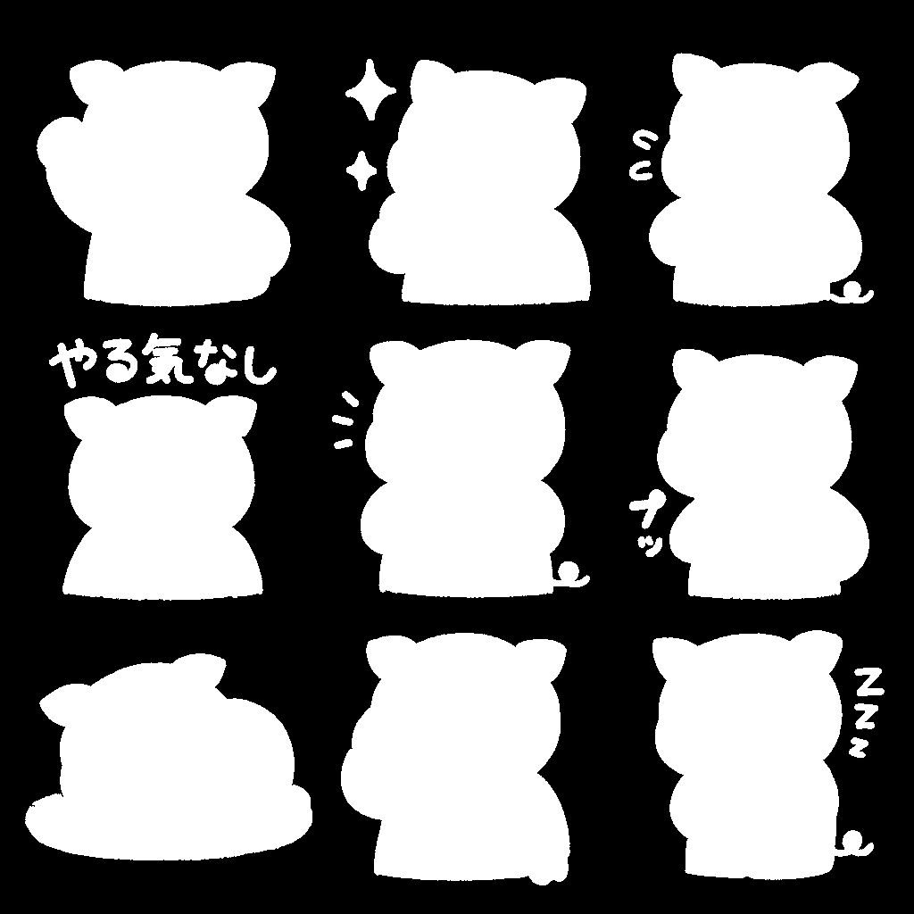
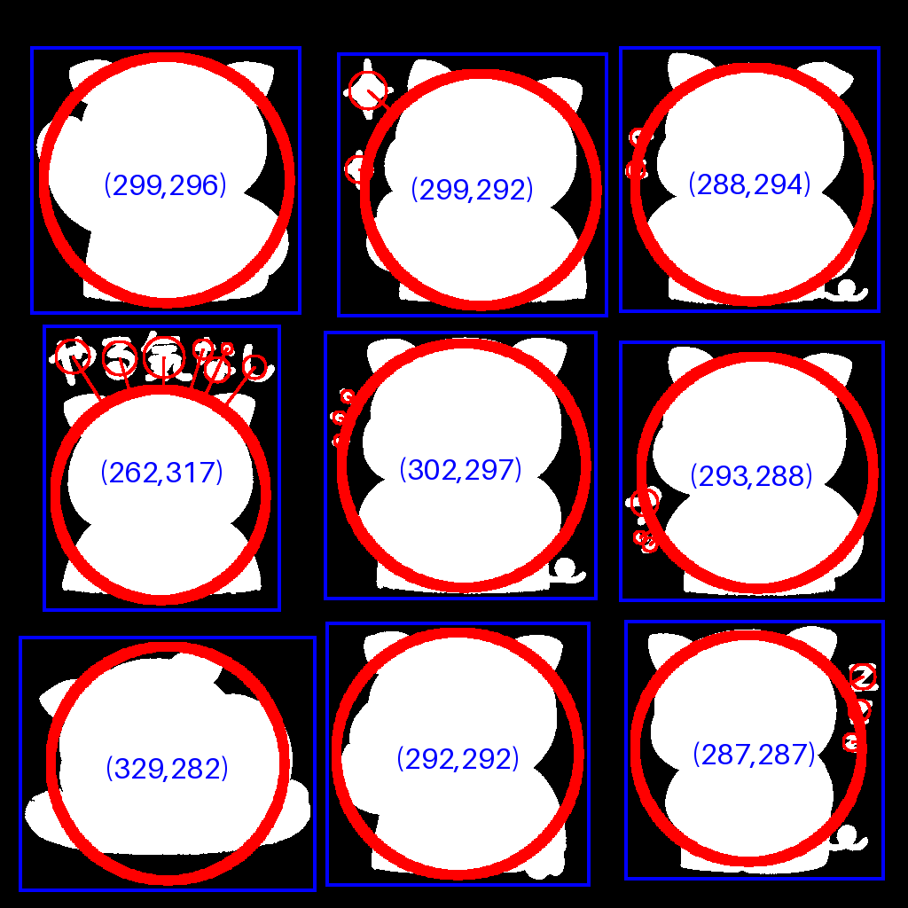
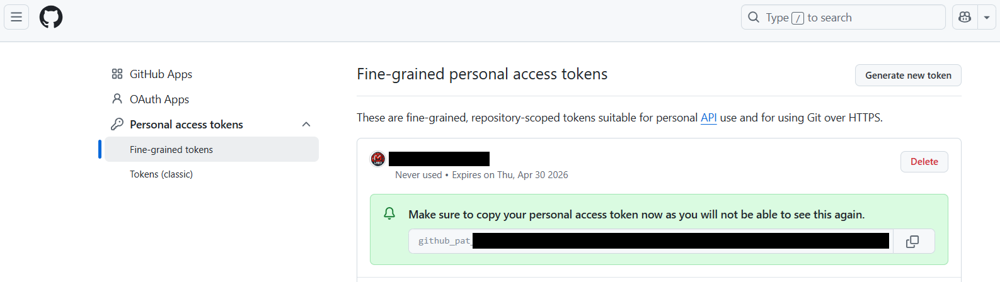

# LINE Stamp Creator

LINEスタンプを作成するためのプロジェクトです。

## 概要

このプロジェクトは、LINEスタンプの作成を支援するツールを提供します。
また、Cursor Pro版によりプロジェクトを作成しています。

## 環境構築

1. Python 3.8以降をインストールしてください。
2. プロジェクトディレクトリで仮想環境を作成します。
   ```sh
   python3 -m venv .venv
   ```
3. 仮想環境を有効化します。
   - Linux/macOS:
     ```sh
     source .venv/bin/activate
     ```
   - Windows:
     ```sh
     .venv\Scripts\activate
     ```
4. 依存パッケージをインストールします。
   ```sh
   pip install -r requirements.txt
   ```

## 実行手順

1. 必要なパッケージをインストール（初回のみ）

```bash
python -m venv .venv
source .venv/bin/activate  # Windowsの場合は .venv\Scripts\activate
pip install -r requirements.txt
```

2. `input`フォルダに処理したいPNG画像をすべて配置します。

3. スクリプトを実行します。

```bash
python scripts/mask_generator.py
```

4. `output`フォルダ内に、各画像ごとに
   - マスク画像（`*_mask.png`）
   - 青枠付き画像（`*_bounding.png`）
   - 切り出し済みスタンプ画像（`*-1.png` ～ `*-9.png`）
が自動生成されます。

---

- 画像サイズや透明化、分割方法はLINEスタンプの仕様に準拠しています。

## 機能

- 入力画像（PNG）から自動で背景除去マスクを生成
- マスク画像から主なオブジェクトを検出し、青枠（バウンディングボックス）を描画
- 青枠領域を元画像・マスク画像から切り出し、LINEスタンプ規格（最大370x320）にリサイズ
- マスクの黒部分を透明化し、スタンプ画像として出力
- inputフォルダ内の全PNG画像を一括処理
- 出力ファイルはoutputフォルダに自動保存（`*_mask.png`, `*_bounding.png`, `*-1.png`～`*-9.png`）

## アルゴリズム詳細・制約

### マスク生成のアルゴリズム
- 入力画像の外周ピクセルの平均色を「背景色」とみなします。
- その背景色と近い色（ユーザー定義のしきい値以内）をFlood Fill法で塗りつぶし、背景領域を特定します。
- 背景以外の領域を白（255）、背景を黒（0）としたマスク画像を生成します。

例：  


### バウンディングボックスの決め方
- マスク画像上で白領域（255）を連結成分ラベリング（8近傍）で抽出します。
- 各ラベルごとにバウンディングボックス（最小矩形）を計算し、パディングを加えた範囲を青枠として描画します。
- 面積の大きい順に9個のバウンディングボックスを選び、左上から右下の順（y座標→x座標昇順）で並べて出力します。

例：  


### 制約・注意点
- 本ツールは「3x3グリッド（最大9個）」のLINEスタンプ画像を想定しています。
- オブジェクト同士が隣接または接触している場合、ラベリング処理で1つのオブジェクトとみなされることがあります。
  （この場合、バウンディングボックスも統合されるため、意図しない範囲が切り出されることがあります）
- オブジェクトの分離精度は元画像や背景色、しきい値設定に依存します。

## GitHub Personal Access Token（PAT）発行・管理手順

### 1. PATの発行方法
1. GitHubにログインし、右上のアイコンから「Settings」を選択。
2. 左メニュー下部の「Developer settings」→「Personal access tokens」→「Tokens (classic)」または「Fine-grained tokens」を選択。
3. 「Generate new token」から新規トークンを作成。
4. アクセス範囲（例：All repositories）や権限（例：Contents: Read and write）を設定。
5. 「Generate token」をクリックし、表示されたトークンを必ずコピーして安全な場所に保存。



### 2. PATの利用方法
- git push/pullなどの操作時、パスワード入力欄にPATを貼り付ける。
- 一度認証すれば、credential.helperの設定により次回以降は自動認証される場合が多い。

### 3. PATの管理・注意点
- トークンは他人に絶対に教えない。
- 万が一漏洩した場合や不要になった場合は、GitHubの「Personal access tokens」画面から削除（Revoke/Delete）する。
- 必要に応じていつでも新しいPATを発行できる。
- cursorはWSL側のgitではなくPowerShell側のgitから操作しているので注意。

--- 