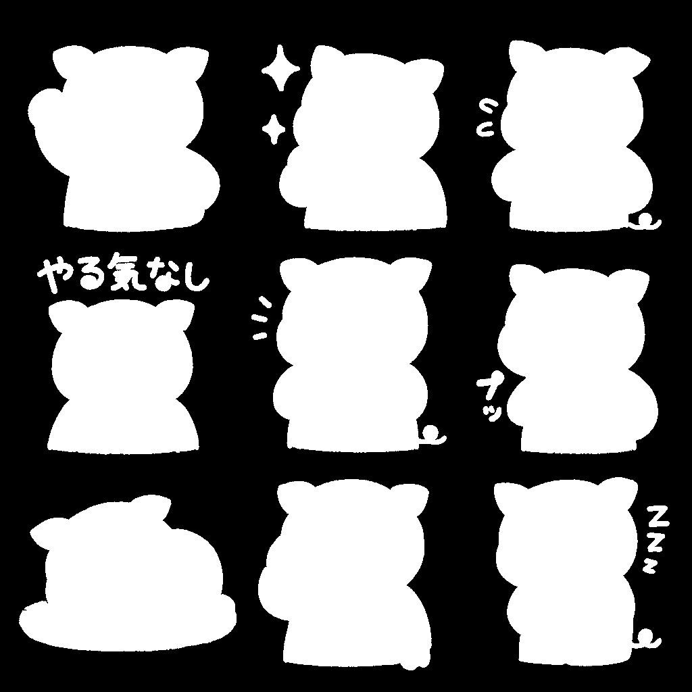
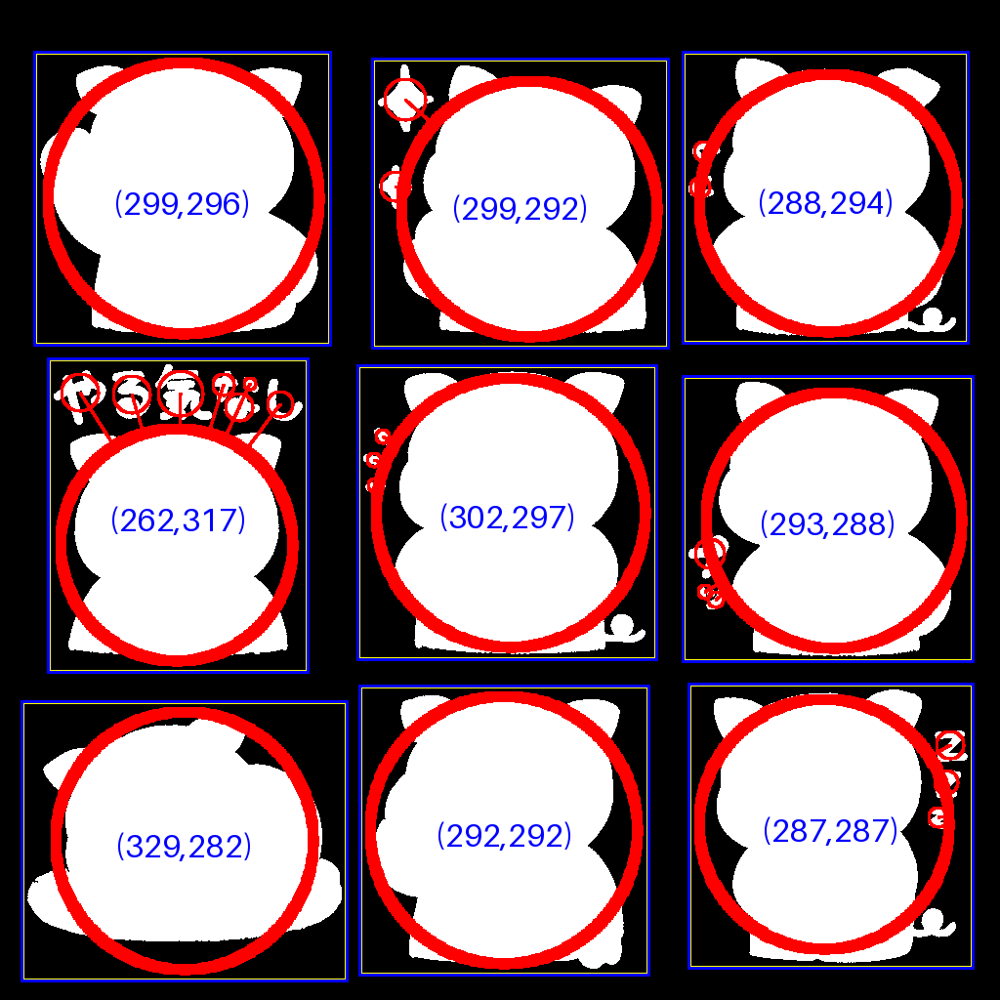
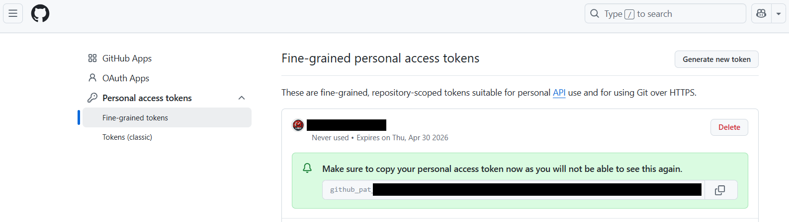

# LINE Stamp Creator

LINEスタンプを作成するためのプロジェクトです。

## 概要

### 1. LINEスタンプ作成支援
このプロジェクトは、LINEスタンプの作成を支援するツールを提供します。
OpenAIの画像生成APIを使用して画像を生成し、自動的に分割・リサイズしてLINEスタンプ用の画像を作成します。

### 2. AI活用の実践例
本プロジェクトは、以下のAI技術を活用した実践例としても位置づけています：

- **[OpenAI](https://openai.com/)画像生成API**
  - プロンプト設計による高品質な画像生成
  - キャラクターやシーンの一貫性を保持

- **[Cursor Pro](https://cursor.sh/)のAIアシスタント**
  - プロンプト設計、コード生成、ドキュメント作成まで一貫したサポート
  - 手動での実装を最小限に抑えた効率的な開発

## 環境構築

1. Python 3.8以降をインストールしてください。
2. プロジェクトディレクトリで仮想環境を作成します。
   ```sh
   python3 -m venv .venv
   ```
3. 仮想環境を有効化します。
   - Linux/macOS:
     ```sh
     source .venv/bin/activate
     ```
   - Windows:
     ```sh
     .venv\Scripts\activate
     ```
4. 依存パッケージをインストールします。
   ```sh
   pip install -r requirements.txt
   ```

## 実行手順

1. 必要なパッケージをインストール（初回のみ）
```bash
python -m venv .venv
source .venv/bin/activate  # Windowsの場合は .venv\Scripts\activate
pip install -r requirements.txt
```

2. プロンプト設定ファイルを編集
- `input/global_config.yaml`: 全体の画風や条件
- `input/character_config.yaml`: キャラクターの特徴
- `input/scenes_config.yaml`: 各シーンの構図やセリフ

3. OpenAI APIキーを設定
```bash
cp .env.example .env
# .envファイルを編集してOPENAI_API_KEYを設定
```

4. 画像を生成
```bash
python openai_image_gen.py
```
生成された画像は`output/generated/`に保存されます。

5. 画像を分割
```bash
python scripts/mask_generator.py
```

6. 分割された画像は`output/`直下に保存されます。
- `output/`直下: 分割済みスタンプ画像（`*-1.png` ～ `*-9.png`）
- `output/masks/`: マスク画像（`*_mask.png`）
- `output/bounding/`: 青枠付き画像（`*_bounding.png`）

## フォルダ構成

```
.
├── input/
│   ├── global_config.yaml    # 全体の画風や条件
│   ├── character_config.yaml # キャラクターの特徴
│   └── scenes_config.yaml    # 各シーンの構図やセリフ
├── output/
│   ├── generated/           # OpenAIで生成された画像
│   ├── masks/              # マスク画像（参考用）
│   ├── bounding/           # バウンディングボックス画像（参考用）
│   └── *.png              # 分割済みスタンプ画像
├── scripts/
│   └── mask_generator.py   # 画像分割スクリプト
└── openai_image_gen.py     # 画像生成スクリプト
```

## 機能

- 入力画像（PNG）から自動で背景除去マスクを生成
- マスク画像から主なオブジェクトを検出し、青枠（バウンディングボックス）を描画
- 青枠を全て描画。validなものだけ黄色枠を重ねて描画
- 青枠領域を元画像・マスク画像から切り出し、LINEスタンプ規格（最大370x320）にリサイズ
- マスクの黒部分を透明化し、スタンプ画像として出力
- inputフォルダ内の全PNG画像を一括処理
- 出力ファイルはoutputフォルダに自動保存（`*_mask.png`, `*_bounding.png`, `*-1.png`～`*-9.png`）

## アルゴリズム詳細・制約

### マスク生成のアルゴリズム
- 入力画像の外周ピクセルの平均色を「背景色」とみなします。
- その背景色と近い色（ユーザー定義のしきい値以内）をFlood Fill法で塗りつぶし、背景領域を特定します。
- 背景以外の領域を白（255）、背景を黒（0）としたマスク画像を生成します。

例：  


### バウンディングボックスの決め方
- マスク画像上で白領域（255）を連結成分ラベリング（8近傍）で抽出します。
- 各ラベルごとにバウンディングボックス（最小矩形）を計算し、パディングを加えた範囲を青枠として描画します。
- 面積の大きい順に9個のバウンディングボックスを選び、左上から右下の順（y座標→x座標昇順）で並べて出力します。
- バウンディングボックスの幅または高さが500pxを超える場合は出力対象外となります。
- validなバウンディングボックスは黄色枠で強調されます。

例：  


### 制約・注意点
- 本ツールは「3x3グリッド（最大9個）」のLINEスタンプ画像を想定しています。
- オブジェクト同士が隣接または接触している場合、ラベリング処理で1つのオブジェクトとみなされることがあります。
  （この場合、バウンディングボックスも統合されるため、意図しない範囲が切り出されることがあります）
- オブジェクトの分離精度は元画像や背景色、しきい値設定に依存します。

## GitHub Personal Access Token（PAT）発行・管理手順

### 1. PATの発行方法
1. GitHubにログインし、右上のアイコンから「Settings」を選択。
2. 左メニュー下部の「Developer settings」→「Personal access tokens」→「Tokens (classic)」または「Fine-grained tokens」を選択。
3. 「Generate new token」から新規トークンを作成。
4. アクセス範囲（例：All repositories）や権限（例：Contents: Read and write）を設定。
5. 「Generate token」をクリックし、表示されたトークンを必ずコピーして安全な場所に保存。



### 2. PATの利用方法
- git push/pullなどの操作時、パスワード入力欄にPATを貼り付ける。
- 一度認証すれば、credential.helperの設定により次回以降は自動認証される場合が多い。

### 3. PATの管理・注意点
- トークンは他人に絶対に教えない。
- 万が一漏洩した場合や不要になった場合は、GitHubの「Personal access tokens」画面から削除（Revoke/Delete）する。
- 必要に応じていつでも新しいPATを発行できる。
- cursorはWSL側のgitではなくPowerShell側のgitから操作しているので注意。

## OpenAI画像生成APIのモデルについて

- 2025年5月時点で、OpenAIの画像生成APIで利用できる主なモデルは以下の通りです。
    - **gpt-image-1** : 最新の高精度画像生成モデル。
    - **dall-e-3** : 高精度・高画質な画像生成モデル。
    - **dall-e-2** : 従来の画像生成モデル。
- 画像生成APIを利用する際は、`model="gpt-image-1"` や `model="dall-e-3"` などと指定してください。
- 最新のモデル情報はOpenAI公式ドキュメント（https://platform.openai.com/docs/models など）でご確認ください。

### サンプル（Python）
```python
response = openai.images.generate(
    model="gpt-image-1",  # または "dall-e-3"
    prompt="A cute cat in a suit",
    n=1,
    size="1024x1024",
    response_format="url"
)
```

## 画像生成スクリプト（openai_image_gen.py）の使い方

### 基本的な使い方

```bash
python scripts/openai_image_gen.py --scenes <シーン設定YAML> [--model <モデル名>] [--global <グローバル設定YAML>] [--objects <オブジェクト設定YAML>] [--output_dir <出力ディレクトリ>] [--prompt_only]
```

#### 主なコマンドライン引数
- `--scenes` または `-s` : シーン設定YAMLファイル（必須）
- `--model` : 画像生成モデル（省略時はgpt-image-1、動作確認用にはdall-e-3も指定可能）
- `--global` : グローバル設定YAMLファイル（省略時はinput/global_config.yaml）
- `--objects` : オブジェクト設定YAMLファイル（省略時はinput/objects_config.yaml）
- `--output_dir` : 画像出力ディレクトリ（省略時はoutput/generated）
- `--prompt_only` : 画像生成を行わずプロンプトのみ出力

#### 具体例

1. 標準的な画像生成（gpt-image-1モデル）
```bash
python scripts/openai_image_gen.py --scenes input/scenes-006.yaml
```

2. 動作確認・テスト用画像生成（dall-e-3モデル）
```bash
python scripts/openai_image_gen.py --scenes input/scenes-006.yaml --model dall-e-3
```

### 注意事項
- **モデルの変更は可能ですが、DALLE3の場合は3x3マトリックス配置や細かな指示がうまく反映されないことが多いです。**
- **gpt-image-1は高額な課金が発生するため、基本的には本番用・高品質生成用とし、動作確認やテストにはdall-e-3の利用を推奨します。**
- 本番運用や高品質な画像生成には`gpt-image-1`などの最新モデルを推奨します。

### 設定ファイルの役割
- `input/global_config.yaml` : 全体の画風や共通条件
- `input/objects_config.yaml` : キャラクターや小物の詳細説明
- `input/scenes-XXX.yaml` : シーンごとの構図やセリフ案

--- 